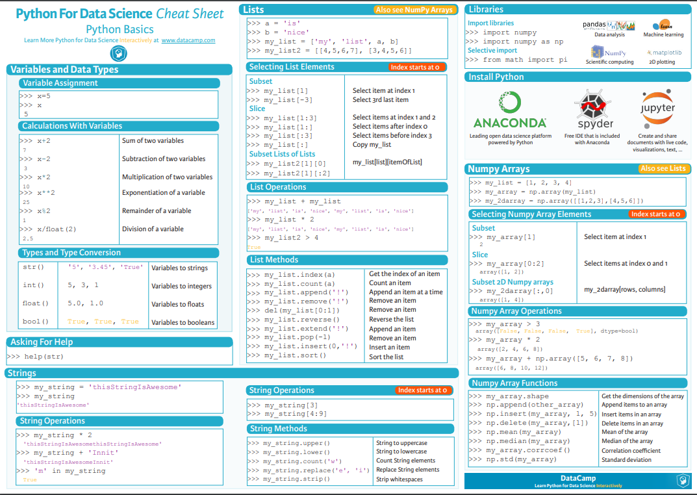

# Introducción al curso de Machine Learning Aplicado con Python

Bienvenidos al **Curso de Machine Learning Aplicado con Python**, en este curso veremos cómo utilizar Machine Learning con distintas librerías de Python. Particularmente estaremos utilizando **_Scikit-Learn_**, que es una de las más utilizadas de la industria.

En este curso también nos enfocaremos es en entender todo el flujo de trabajo que se hace cuando se resuelve un problema de **Machine Learning**.

Además de entender muy bien los algoritmos de **Machine Learning** que estaremos viendo, veremos otras disciplinas que son tanto o más importantes como el **Feature Engineering** y la selección de modelos.

> **Machine Learning = Programación + Estadística**

## Importancia de definir el problema en Machine Learning

**Errores comunes** que se ven cuando no se define bien el problema y se comienza a codear:

- No hay problemas por resolver.
- Existen soluciones más simples.
- No se puede medir el impacto del modelo.
- No se sabe si el problema ya ha sido resuelto antes.
- El problema es imposible de resolver.

**Preguntas clave** para reconocer el **tipo de aprendizaje** que se necesita:

- ¿Qué beneficio se puede generar y para quién?
- ¿Cuál de las siguientes funcionalidades sería más útil para lograr el objetivo?

**a)** Predecir alguna métrica (Aprendizaje supervisado)
**b)** Predecir una etiqueta (Aprendizaje supervisado)
**c)** Agrupar elementos similares.
**d)** Optimizar un proceso con prueba y error.

**Preguntas clave** para aterrizar el **problema de aprendizaje supervisado**:

- ¿De qué tipo es el valor que se quiere predecir?

  - a) Continuo
  - b) Discreto

- ¿Cuál es la definición de éxito en una predicción?
- ¿Con qué datos se contaría para hacer esa predicción?
- ¿La pregunta que se está tratando de resolver pertenece a alguna disciplina en particular?
- Considerando nuestra intuición en la disciplina ¿Los datos nos permiten predecir el objetivo?

## Terminología de Machine Learning

- **Datos tabulares** = Datos en dos dimensiones.
- **Líneas** = Ejemplos
- **Columna** = Feauture. Éstas son importantes porque nos van a ayudar a predecir cosas gracias a los modelos que usemos de Machine Learning.
- **Cantidad de columnas** = Dimensión de los datos
- **Output de un algoritmo de Machine Learning (ML)** = Modelo
  Variable objetivo = Target

Los materiales del curso se encuentran en el repositorio [Machine Learning Platzi](https://github.com/JuanPabloMF/machine-learning-platzi/tree/master)

## El ciclo de Machine Learning

Muchas veces pensamos que hacer **Machine Learning** corresponde solamente a implementar un algoritmo de cualquiera de las librerías y con ello ya existe la solución a un problema. Pero en realidad existe todo un ciclo de trabajo donde los algoritmos de **Machine Learning** son solo una etapa, sin embargo, las demás etapas también son muy importantes y toman su tiempo para lograr los resultados que esperamos.

Hacer **Machine Learning** corresponde a trabajar en un ciclo, ir trabajando varias etapas e ir iterando.

**Ciclo de Machine Learning**:

- Definición del problema.
  - Aprendizaje Supervisado?
  - Variable Objetivo (Labels)
  - Métrica de evaluación
- Preparación de los datos.
  - Obtención de datos
  - Join de BDDS
  - Limpieza de datos
- Representación de los datos.
  - Análisis exploratorio de dayos
  - Extracción manual de features
  - Extracción automática
  - Selección de features
- Modelamiento / Algoritmos de ML.
  - Selección del modelo
  - Fiteo de algoritmo
  - Predicción
- Evaluación.
  - Cross Validation
  - Underfill o Overtilting
  - Optimización de hyperparámetros

Este no es el final del proceso, se debe iterar hasta que en alguna de las iteraciones salga la solución al problema.

- Producción (Fin del proceso).

> **Navaja de Ockans o pasimonia** Si se tine 2 soluciones a un problema y una es más simple, simpre optar por la más sencilla y poco a poco se va iterar el algoritmo para hacerlo más complejo.

> El **Feature Engineering** es muy importante; algunos expertos mencionan que todo el arte del Machine Learning está en definir bien los features

## :one: Montar un ambiente de trabajo Pydata

En este curso utilizaremos **Jupyter Notebooks** y el **stack Pydata**, que incluye las librerías _Numpy, Pandas, Matplotlib y Scikit-learn_.

En lo que sigue te presento 3 opciones para trabajar con estas tecnologías:

1. Trabajar en el cloud gracias a la excelente herramienta Google Colab.
2. Trabajar en local en tu computadora gracias a Anaconda.
3. Trabajar en tu computadora virtualizando a través de contenedores con Docker.

> Google Colab es la opción mas facil de usar, así que esta es la opción oficial recomendada por el curso.

_Anaconda permite que trabajes en local, y Docker es bueno para usos en producción_

### :star: Google Colab

Google Colab es muy similar en su uso a Google Docs. Puedes ir directamente a su pagina https://colab.research.google.com/ o abrir Google Drive, clickear en el botón “+ Nuevo” y desde ahí elegir la opción “Mas” y clickear en Colaboratory (como se ve en la imagen)


_Con esto tendrás un notebook de Google Colab a tu disposición!_


:fire: Un notebook se compone de celdas de codigo y de texto. Una celda de codigo es ejecutable tecleando **“Control + Enter”**. Para probar que todo esta ok puedes ejecutar el siguiente codigo:

```python
import numpy as np
import pandas as pd
import matplotlib.pyplot as plt
import sklearn
```

Veras arriba a la derecha que colab se esta conectando a una instancia de computo en la nube (esto colab lo hace solo, no te preocupes!). Esta conexión la realiza solo la primera vez.


Una vez conectado, el código que ingresaste se ejecutara, y veras que efectivamente los imports se harán sin ningún problema por lo que ya tienes todo lo que necesitas para trabajar!

Un solo punto adicional que queda por aclarar es que como estas trabajando en la nube no tienes directamente los archivos de la clase a mano para poder leerlos desde el notebook.

Para poder acceder los archivos del curso puedes hacer lo siguiente:

1. Encuentra el link hacia el archivo que quieres cargar en el repositorio de github https://github.com/JuanPabloMF/datasets-platzi-course
2. Con el link del archivo csv puedes llamar la función de pandas read_csv de la siguiente manera:

```py
import pandas as pd
pd.read_csv(url)
```

Ya puedes entrar de llenos al curso y empezar a implementar tus primeros modelos de machine learning!

Para más información ver la guía [Configuración del ambiente de trabajo con Google Collab](setup-environment.pdf). Abrirla en un navegador.

## Qué es y cómo se utiliza Numpy

Datos importantes:

- **Numpy** es una librería muy importante para el ecosistema de **Python** ya que es la base de todos los cálculos científicos y muchas de las librerías de **Machine Learning**.
- **Scikit-Learn** con sus modelos, cuando retorna un resultado, en general lo retorna en un formato Numpy.
- La API de **Numpy** tiene muchas similitudes con **Pandas**.
- **Numpy** reemplaza de forma más eficiente lo que podría ser un tipo lista. En las listas podemos tener conjuntos de elementos numéricos. Sin embargo las listas no logran manejar datos de dos dimensiones.
- Las listas no poseen métodos que son prácticos para hacer aritmética.
- Es importante saber que otros lenguajes de programación poseen librerías altamente optimizadas para hacer cálculos numéricos con vectores de datos. **Numpy** es esa librería para el lenguaje de programación de **Python**.
- **`np.linspace`** es una función que permite crear un array de una dimensión de números entre `0 y 1`.
- Los **array** a diferencia de otros objetos en Python están fuertemente tipificados. Esta tipificación fuerte es necesaria porque es una de las cosas que permite que esta librería sea más rápida que ocupar listas, por ejemplo.

* `list` No tiene buen manejo para los índices cuando se trabaja _con listas de datos de más de dos dimensiones_
* `list` no podee métodos de álgebra lineal, ni de transformaciones de datos
* En otros lenguajes encontramos estructuras de librerías de datos altamente optimizadas para poder hacer operaciones algebraicas sobre arrays.

Por eso Numpy se erige todo un ecosistema de librería muy útiles que se utilizaran en este curso.

:blue_book: La guía de esta etapa estpa en el cuaderno [ Introducción_a_python_científico.ipynb](https://github.com/jocode/machine-learning-python/blob/master/Introducción_a_python_científico.ipynb)

### Crear Arrays

```py
#importar la librería
numpy as np

a1 = np.array([1,2,3,4]) # Con una lista

```

Algunas sugerencias de manejo de python para Data Science



_En PDF [PythonForDataScience.pdf](https://s3.amazonaws.com/assets.datacamp.com/blog_assets/PythonForDataScience.pdf)_

## :two: Preparación de los datos

:blue_book: La descripción paso a paso de esta etapa está en el notebook [ Preparación_de_los_datos.ipynb](https://github.com/jocode/machine-learning-python/blob/master/Preparación_de_los_datos.ipynb)

_Ó podemos usar la referncia de la clase en [09 Preparación de los datos.ipynb](https://github.com/JuanPabloMF/machine-learning-platzi/blob/master/09%20Preparación%20de%20los%20datos.ipynb)_

### Cargar los datos necesarios para el proyecto.

Las librerías con las que vamos a trabajar y que tenemos que cargar son:

- **Numpy**
- **Pandas**
- **Matplotlib.pyplot**
- **Seaborn**

#### Cargar el dataset usando Google Colab

```py
# Cargar el dataset desde drive
from google.colab import drive
drive.mount('/content/drive')
```

Aparecerá unas indicaciones con un URL y un espacio para un código de autorización que obtienen del URL. Copian y pegan el código en el cuadro correspondiente para obtener los permisos

Una vez hagan esto pueden acceder a sus archivos en su drive desde colab usando:

**`movies = pd.read_csv('drive/My Drive/', encoding = ‘utf-8’)`**, donde `drive/My Drive/` es la ruta raíz en drive.

```py
movies = pd.read_csv('drive/My Drive/Colab Notebooks/datasets/machine_learning_python/peliculas.csv', encoding='utf-8')
```

### Inspección de los tipos de datos

**Datos importantes:**

- La **inspección de los datos** se da para tener conocimiento de la salud de los datos que tenemos, saber si vienen limpios o no, y también porque se quiere tener un entendimiento cuantitativo de ellos. Parte de esto es mirar gráficos estadísticos y entender diferentes propiedades numéricas de las columnas.
- A diferencia de **Numpy**, **Pandas** no solo permite cargar datos numéricos, sino también datos de texto.
- El método info nos va a mostrar la cantidad completa de columnas con la cantidad de elementos no nulos que hay en esas columnas, y por último muestra el tipo de cada columna.

### Inspección cuantitativa y de salud de los datos

Se realiza la inspección de los datos en la cantidad de recursos que ha costado realizar la producción de la película donde nos encontramos que no se tuvo en cuenta el tipo de moneda utilizada. Para ello, tocó recurrir a otro dataset de la base de datos `thenumbers.com` para luego hacer un merge entre ambas base de datos usando la segunda (thenumber) como el dataset principal y trayendo los datos del dataset (movies)

Para tener en cuenta al **borrar una columna**

```py
movies_num.drop(['movie_title'], axis=1)
movies_num
```

### Manejo de datos faltantes

Para obtener los datos faltantes es poder saber cuántos datos faltantes existen por columnas, y en base a ello se toman las estrategias.

En el caso de las features que no son la variable objetivo una mejor solución para lidiar con los datos faltantes es **remplazar estos datos por otros que sean manejables** y no afecten la calidad de las predicciones.

- _La estrategia más comun es utilizar la media de todos los ejemplos para la feature dada._ Usando sklearn con la estrategia `strategy='mean'`

> En caso que no funcione la importación de sklearn Imputer, puede que la librería se haya actualizado desde el momento que se grabo la clase. Así que se puede reemplazar.

```py
from sklearn.preprocessing import Imputer
imputer = Imputer(missing_values=np.nan,strategy = 'mean', axis=1)
```

Por el siguiente

```py
from sklearn.impute import SimpleImputer
imputer = SimpleImputer(missing_values=np.nan, strategy='mean')
```

## :three: Modelación y evaluación

### El objeto estimador de Scikit-Learn

**Datos importantes:**

- Por como fue diseñado **`Scikit-Learn`**, existe una API muy fácil de ocupar y muy unificada. Esta unificación se da por un objeto que se llama “estimador” que tiene en todos los casos y para el algoritmo de Machine Learning que sea, una API que es común y 3 métodos que son clave.
- **Scikit-Learn** posee muchos modelos, se pueden implementar tanto, regresiones lineales como regresiones regularizadas, árboles de decisión, SDMs, etc.
- **Scikit-Learn** contiene todos los modelos que son usados hoy en día, y una de las virtudes de esta librería es que sigue muy de cerca lo que pasa en la investigación.
- **Scikit-Learn** es la librería más usada de _Machine Learning General_, no de _Machine Learning Especializado_, para ello está la librería de **Tensor Flow** y sirve casi exclusivamente para **_modelos de Deep Learning_**.

* **SciKit-Learn**: Modelos Machie Learning
* **Tensor Flow**: Modelos Deep Learning.

Los datos de entrenamiento se deben separar, dependiendo de la cantidad de datos se toma un porcentaje para entrenar(70%-80%) y otro para hacer test. Ésta operación entrega 4 salidas -Datos de entrenamiento, target de entrenamiento, datos de test y target de test-
**fit**: Entrenar un modelo, se necesitan datos de entrenamiento (matriz), los datos o valores(vector) objetivos (target).
**Predict**: Método para obtener predicciones del modelo ya entrenado, ingresa un valor nuevo y predice una salida.
**Score**: con los datos de test podemos obtener una métrica de performance.

:star: [Cheat Sheet scikit-learn](https://scikit-learn.org/stable/tutorial/machine_learning_map/index.html)


_Ruta para escoger el modelo de Machine Learing_

### Implementar un modelo de regresión (Lasso)

```py
X = pd.read_csv('drive/My Drive/Colab Notebooks/datasets/machine_learning_python/intermediate_results/X.csv')

y = X['worldwide_gross']
X = X.drop('worldwide_gross', axis=1) # Eliminamos esa columna

# Importamos SckitLearn
from sklearn.model_selection import train_test_split

# Los datos de test se colocan en 40%
X_train, X_test, y_train, y_test = train_test_split(X, y, test_size=0.4, random_state=11)

# Verificamos la cantidad de datos
print(len(X))
print(len(X_train))
print(len(X_test))


# Ahora sí implementamos el modelo
# Implementación del Modelo usando una regresión lasso
from sklearn.linear_model import Lasso

# Se instancia el modelo Lasso
model = Lasso()
```

### Ajustando Modelos de Machine Learning, Underfitting y Overfitting

- **Underfitting:** Modelo usado muy simple, no logra capturar el patrón que siguen los datos. Se equivoca con los datos de entrenamiento y con los datos de test.

- **Overfitting:** El error de entrenamiento va a ser bajo, pero el error de test es muy alto. Modelo muy ajustado a los datos de entrenamiento. Modelo muy complejo.

- **Lo que buscamos:** Queremos un error de entrenamiento bajo, un error de test bajo y la diferencia entre los dos errores también debería ser bajo. Se busca un polinomio no tan basico ni tan complejo.

* En el polinomio de grado 1 tiene un error alto en los datos de entrenamiento y los de test
* En los polinimios de grado 10, tienen un error bajo en los datos de entrenamiento y alto en los datos de test
* Un polinomio de grado 2 se puede lograr que el error de entrenamiento sea bajo, que el error de prueba sea bajo y que la diferencia entre los dos errores sea la mas mínima posible, en otras palabras mucho menor que 1.

### Evaluando el modelo

Se grafica los resultados obtenidos en el modelo para verificar si los datos analizados son correctos

[Anscombe's quartet](https://en.wikipedia.org/wiki/Anscombe%27s_quartet)
